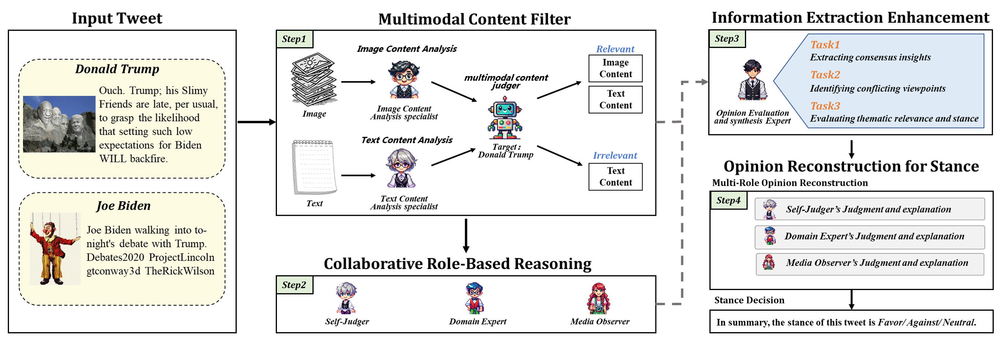
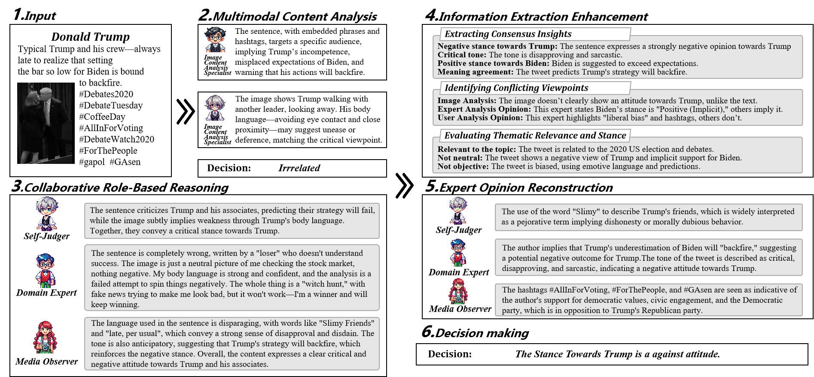
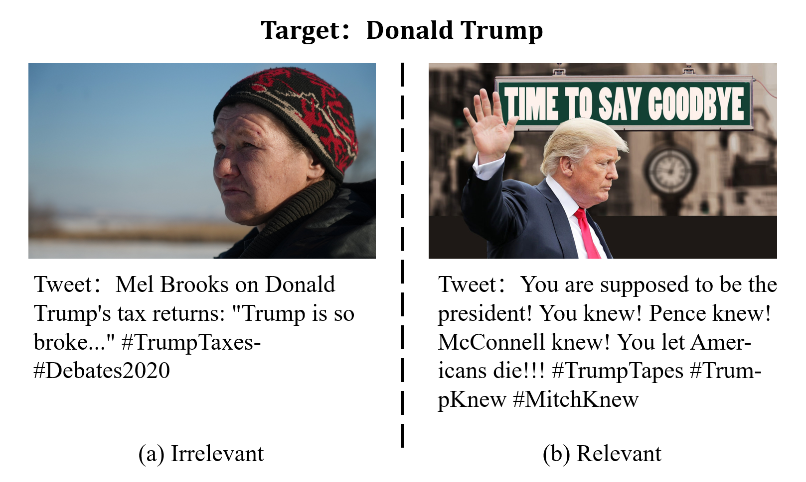

# CoRI: Collaborative Role-Infused Framework for Multimodal Stance Detection

<div align="center">
    <h3>A Novel Framework for Enhanced Multimodal Stance Detection</h3>
</div>

## 📝 Introduction
CoRI is an innovative framework for multimodal stance detection, focusing on analyzing stance in social media content. The framework enhances stance detection accuracy through the following innovations:

- Introduction of a multimodal content filter module to select relevant images and filter out distractions
- Implementation of multi-role reasoning extraction and reconstruction module using targeted Q&A framework
- Demonstrated superior performance in both accuracy and robustness compared to existing methods on three public datasets

## 🔍 System Architecture
You can add your image using:




Suggestions:
1. Create an 'assets' or 'images' folder for storing images
2. Name your image as 'framework.png' or 'architecture.png'
3. Use relative paths for image references
## casestudy


## case of image bias

## ⭐ Key Features
- **Multimodal Content Filtering**:
  - Intelligent image selection
  - Distraction reduction through relevance assessment
- **Multi-Role Reasoning Mechanism**:
  - Linguistic Analysis: Expert role-based text feature analysis
  - Image Relevance Assessment: Semantic correlation evaluation
  - Stance Inference: Multimodal feature-based stance determination
- **Comprehensive Output Generation**: Detailed analysis reports and results storage

## 🛠️ Requirements
- Python 3.8
- Dependencies:
  ```
  openai
  pandas
  ```

## ⚙️ Configuration
1. Environment Setup:
   - OpenAI API Key
   - SiliconFlow API Base URL
   - Data File Paths

2. Configuration Example:
   ```python
   client = OpenAI(
       api_key="your_api_key",
       base_url="https://api.siliconflow.cn/v1"
   )
   ```

## 📋 Usage Instructions
1. Data Preparation:
   - Required CSV columns: `tweet_image`, `tweet_text`, `stance_target`
   - Image files must be placed in the designated directory

2. Running the Program:
   ```
   python m1.py
   python m2.py
   python m3.py
   python m4.py
   python m5.py
   python m6.py
   ```

3. Output:
   - Analysis results are saved in the `analysis_results` directory
   - Each analysis includes:
     - Tweet text
     - Stance target
     - Linguistic analysis results
     - Decision outcomes
   - Final results are saved in CSV format

## ⚠️ Important Notes
- Ensure all dependencies are properly installed
- Verify API key configuration
- Confirm correct data file paths
- Ensure image file accessibility

## 🔧 Error Handling
- Automatic retry mechanism (up to 100,000 attempts)
- Support for multiple CSV file encodings
- Comprehensive error logging

## 📮 Contact
For questions or suggestions, please contact me.


